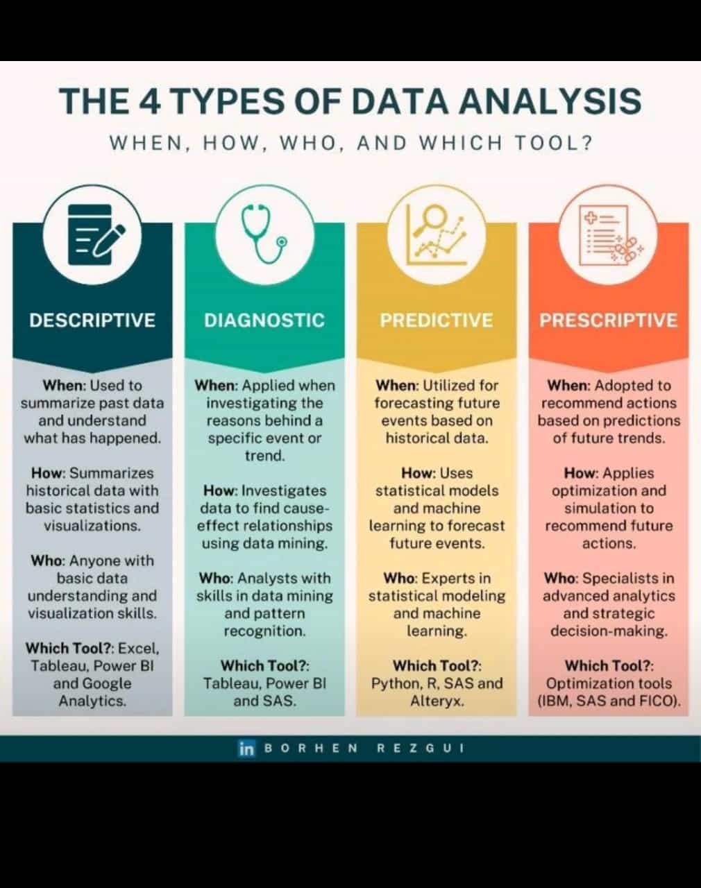

# skillharvest
this repository is about my learning journey with skillharvest academy

# COUNTRY NAMES
## STATE NAMES
### LGA NAMES


# COUNTRY NAMES
- Nigeria
- Ghana
- Canada
- chicago

# Numbers
1. Nigeria
2. Ghana
3. Canada



#  <div align"center">
   
   </div>

   |NAMES|AGES|COUNTRY|CLASS|
   |-|-|-|-|
   |Bola|32|Congo|Year 3|
   |Ade|5|Canada|Year 1|

Python Code to add two different numbers
 ```
 def function (a,b)
  c=a+b
 return c
```

#   HYPERLINK
-   Track your order [here](https://meet.google.com/tge-cycp-aaq)

😄
